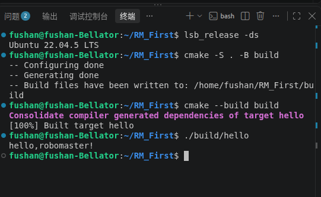

# 新生独立交付仓库（第一次培训作业）
## 环境
- Ubuntu 22.04.5 LTS
- CMake 3.22+
- GCC 11+


## 目录结构
- src文件夹存放源文件main.cpp
- images文件夹存放READEME引用的图片
- build文件夹存放编译缓存和最终程序
## 构建与运行
```bash

cmake -S . -B build
cmake --build build
./build/hello
```
## 预期输出
运行"./build/hello"后，终端将输出:
hello,robomaster!
## 成功截图

***梁升 2264311779 9月18日完成***